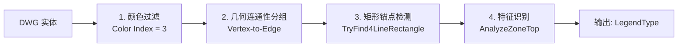
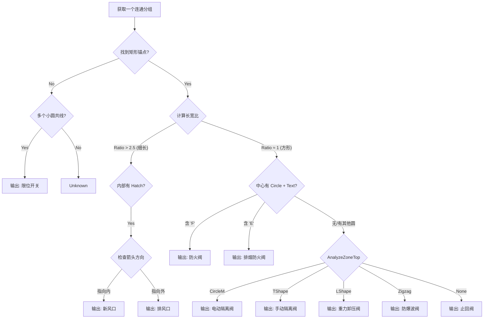

# 暖通CAD图例几何特征识别规范 (完整版)

本文档指导如何使用 `ACadSharp` 通过几何图元（Primitive）的拓扑关系，在没有 Block 定义（炸开状态）的情况下识别图例。

---

## 核心识别流程



### 步骤详解

1.  **预处理 (Filter)**: 筛选所有绿色线条 (`Color.Index == 3` 或 ByLayer 且 Layer Color 为绿色)。
2.  **分组 (Clustering)**: 使用 **Vertex-to-Edge 几何连通性** 将相连的实体归为一组（见下方算法详解）。
3.  **定位 (Anchor)**: 在分组内寻找矩形锚点（`LwPolyline 4V Closed` 或 `4条Line组成的闭合回路`）。
4.  **特征识别 (Recognition)**: 根据锚点的长宽比和 Zone-Top 特征进行分类。

---

## 算法关键实现

### 1. 几何连通性算法 (Vertex-to-Edge Connectivity)

**目的**: 准确判断两个实体是否"连通"，即使它们的端点不直接重合。

**参数**:
-   `tolerance`: **0.1** (严格模式)

**连通判定规则**:

| 实体 A | 实体 B | 连通条件 |
| :--- | :--- | :--- |
| Line/Arc/Polyline | Line/Arc/Polyline | A 的任意端点 **到 B 的几何边缘** 距离 ≤ tolerance，或反向。 |
| Line/Arc/Polyline | Circle | A 的任意端点 **落在 Circle 的边缘上**: `|dist(pt, center) - radius| <= tolerance`。 |
| Circle | Circle | 圆心距离 ≤ tolerance，或两圆相切 (`Abs(dist - r1 - r2) <= tolerance`)。 |

**核心代码逻辑** (`LegendRecognizer.cs`):

```csharp
// IsConnected: 综合 Vertex-Vertex 和 Vertex-Edge 检查
private bool IsConnected(Entity entA, List<XYZ> ptsA, Entity entB, List<XYZ> ptsB, double tol)
{
    // 1. 快速 Vertex-to-Vertex 检查
    foreach (var pa in ptsA)
        foreach (var pb in ptsB)
            if (Distance(pa, pb) <= tol) return true;

    // 2. Vertex-to-Edge 检查 (A 的端点是否落在 B 的几何上, 或反向)
    if (CheckPointsOnEntity(entB, ptsA, tol)) return true;
    if (CheckPointsOnEntity(entA, ptsB, tol)) return true;

    return false;
}

// CheckPointsOnEntity: 点到实体边缘的距离检测
private bool CheckPointsOnEntity(Entity target, List<XYZ> points, double tol)
{
    switch (target)
    {
        case Line l:
            return points.Any(p => DistToSegment(p, l.StartPoint, l.EndPoint) <= tol);
        case Circle c:
            return points.Any(p => Math.Abs(Distance(p, c.Center) - c.Radius) <= tol);
        case LwPolyline pl:
            // 遍历多段线的每条边进行距离判断
            ...
    }
    return false;
}
```

---

### 2. 矩形锚点检测 (TryFind4LineRectangle)

**目的**: 在一个连通分组内，找到可能由多条 Line 组成的矩形（即使分组内存在额外的线条如手柄/阀杆）。

**策略**: **组合遍历** - 对分组内所有 Line 进行 C(n, 4) 组合，判断是否能构成闭合矩形。

**参数**:
-   `tolerance`: **5.0** (允许角点有一定误差)
-   `maxLines`: **50** (超过此数量的 Line 不进行暴力搜索，避免性能问题)

**核心逻辑**:
```csharp
// IsClosedLoop: 判断 4 条 Line 是否能首尾相连形成闭合回路
private bool IsClosedLoop(List<Line> lines, double tolerance, out List<XYZ> orderedCorners)
{
    // 从 lines[0] 开始，尝试找到一条链: L1 -> L2 -> L3 -> L4 -> L1
    // 每一步检查当前线段的端点是否与下一条线段的端点接近 (Distance < tolerance)
    ...
    return Distance(currentPt, startPt) < tolerance; // 闭合检查
}
```

---

### 3. Zone-Top 特征识别 (AnalyzeZoneTop)

**目的**: 分析矩形锚点 **上方区域** 的几何特征，以区分不同类型的阀门。

**判定表**:

| TopFeature | 几何特征 | 对应图例 |
| :--- | :--- | :--- |
| `CircleM` | 垂直线 + Circle + Text "M" | **电动隔离阀** |
| `TShape` | 垂直线（居中）+ 水平线 | **手动隔离阀** |
| `LShape` | 垂直线（偏侧）+ 水平线 | **重力卸压阀** |
| `Zigzag` | 锯齿状 LwPolyline | **防爆波阀** |
| `None` | 无明显组件 | **止回阀** (默认) |

**关键判定逻辑**:

```csharp
private TopFeature AnalyzeZoneTop(List<Entity> entities, BoundingBox rectBox)
{
    // 1. 筛选 Zone-Top 区域的实体 (y >= rectBox.Max.Y - tolerance)
    var topEnts = entities.Where(e => GetBoundingBox(e).Min.Y >= rectBox.Max.Y - 10.0).ToList();

    // 2. CircleM: 垂直线连接到一个包含 "M" 文字的圆
    if (circles.Any())
    {
        foreach (var c in circles)
        {
            string text = GetTextInZone(topEnts, circleBox);
            if (text.Contains("M")) return TopFeature.CircleM;
        }
    }

    // 3. TShape: 垂直线(居中) + 水平线
    var midX = (rectBox.Min.X + rectBox.Max.X) / 2.0;
    var centerVert = lines.FirstOrDefault(l => IsVertical(l) && Math.Abs(l.StartPoint.X - midX) < rectWidth * 0.3);
    if (centerVert != null && /* hasHorizontal */) return TopFeature.TShape;

    // 4. LShape: 任意垂直线 + 水平线 (非居中)
    var anyVert = lines.FirstOrDefault(l => IsVertical(l));
    if (anyVert != null && /* hasHorizontal */) return TopFeature.LShape;

    // 5. Zigzag
    if (topEnts.OfType<LwPolyline>().Any(p => p.Vertices.Count > 4)) return TopFeature.Zigzag;

    return TopFeature.None;
}
```

---

## 完整决策树



---

## 验证结果 (2416流程图图例-通风.dwg)

| 图例类型 | 数量 | 状态 |
| :--- | :--- | :--- |
| **电动隔离阀** | 10 | ✅ |
| **手动隔离阀** | 4 | ✅ |
| **重力卸压阀** | 2 | ✅ |
| **限位开关** | 9 | ✅ (严格容差 0.1 成功分离) |
| **止回阀** | 9 | ✅ |
| **新风口** | 17 | ✅ |
| **总计** | 51 | |